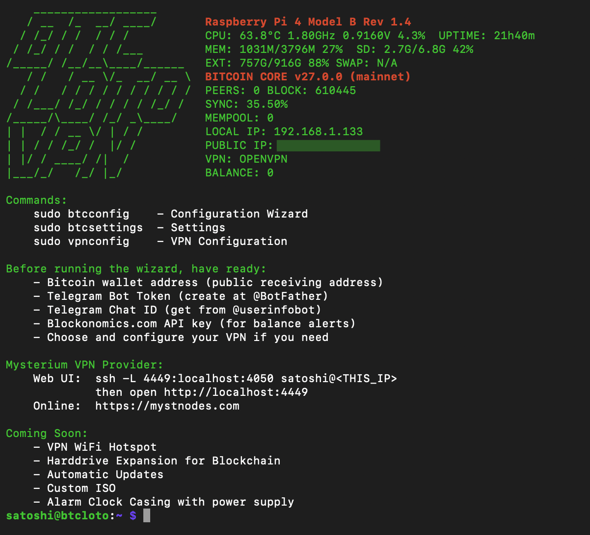

# BtcLotoVpn

**Bitcoin Solo Miner + Multi-VPN + WiFi Hotspot Gateway for Raspberry Pi 4**

Turn your Raspberry Pi into a Bitcoin solo miner with remote Telegram control, multiple VPN options, and a WiFi hotspot that routes all connected devices through VPN.



## Features

- **Bitcoin Solo Mining** - CPU mining with BFGMiner on mainnet
- **Telegram Bot Control** - 50+ commands for remote management
- **Multi-VPN Support** - Tor, Hysteria2, Xray, Outline, OpenVPN, Mysterium
- **WiFi VPN Hotspot** - Create a hotspot that routes all traffic through VPN
- **Wallet Alerts** - Get notified when your balance changes (you mined Bitcoin!)
- **Auto-Recovery** - Connectivity watchdog auto-fixes network issues
- **HD Wallet Generation** - Generate new BIP39 wallets on device

## Hardware Requirements

- Raspberry Pi 4 (4GB+ recommended)
- 1TB+ External HDD (for blockchain storage)
- Reliable internet connection (Ethernet recommended)
- MicroSD card (32GB+)

## Quick Start

### Option 1: Pre-built Image (Recommended)

1. **Download** the latest image from [Releases](https://github.com/micheldegeofroy/BtcLotoVpn/releases)
2. **Flash** using [Raspberry Pi Imager](https://www.raspberrypi.com/software/)
3. **Boot** with 1TB external HDD connected
4. **SSH**: `ssh satoshi@<pi-ip>` (password: `nakamoto`)
5. **Configure**: `sudo btcconfig`

### Option 2: Fresh Install

```bash
curl -sSL https://raw.githubusercontent.com/micheldegeofroy/BtcLotoVpn/main/install.sh | sudo bash
```

## First Boot Setup

Run the configuration wizard:
```bash
sudo btcconfig
```

You'll need:
- Bitcoin wallet address (public receiving address)
- Telegram Bot Token (create at [@BotFather](https://t.me/BotFather))
- Telegram Chat ID (get from [@userinfobot](https://t.me/userinfobot))
- Blockonomics API key (optional, for balance alerts)

## Shell Commands

| Command | Description |
|---------|-------------|
| `sudo btcconfig` | Configuration Wizard |
| `sudo btcsettings` | Settings Menu |
| `sudo vpnconfig` | VPN Configuration |
| `vpn-diag` | VPN Diagnostics |
| `vpn-diag --hotspot` | Hotspot Diagnostics |

---

## Telegram Bot Commands

### General
| Command | Description |
|---------|-------------|
| `/status` | System health overview |
| `/help` | Show all commands |

### Bitcoin
| Command | Description |
|---------|-------------|
| `/startbtc` | Start Bitcoin Core |
| `/stopbtc` | Stop Bitcoin Core |
| `/sync` | Show sync progress |
| `/chainstate` | Chain details |
| `/btc` | Current BTC price |
| `/cal` | Storage calculator |
| `/backup` | Backup to USB |

### Miner
| Command | Description |
|---------|-------------|
| `/startminer` | Start BFGMiner |
| `/stopminer` | Stop BFGMiner |

### Wallet
| Command | Description |
|---------|-------------|
| `/wallet` | Check your balance |
| `/mywallet` | Show your address |
| `/walletcheck` | Check any wallet |
| `/setwallet` | Change wallet address |
| `/checkadd` | Validate an address |
| `/makewallet` | Generate new HD wallet |
| `/chkinterval` | Set balance check interval |

### WiFi Hotspot (VPN Gateway)
| Command | Description |
|---------|-------------|
| `/hotspot` | Hotspot status |
| `/hotspoton` | Start hotspot |
| `/hotspotoff` | Stop hotspot |
| `/hotspotssid` | Set WiFi name |
| `/hotspotpass` | Set WiFi password |
| `/hotspotvpn` | Select VPN (tor/hysteria/outline/xray/openvpn/none) |
| `/hotspotclients` | Show connected devices |
| `/vpndiag` | Run VPN diagnostics |

### Mysterium VPN
| Command | Description |
|---------|-------------|
| `/myston` | Start Mysterium node |
| `/mystoff` | Stop Mysterium node |
| `/myststat` | Node status |
| `/myst` | Show earnings |

### Tor
| Command | Description |
|---------|-------------|
| `/toron` | Start Tor |
| `/toroff` | Stop Tor |
| `/torconfig` | Tor settings menu |
| `/torinstall` | Install obfs4 bridges |
| `/torbridges` | Add bridge addresses |
| `/torshow` | View Tor config |

### OpenVPN
| Command | Description |
|---------|-------------|
| `/ovpn` | VPN status |
| `/ovpnon` | Connect VPN |
| `/ovpnoff` | Disconnect VPN |
| `/ovpnconfig` | Upload .ovpn file |
| `/ovpnshow` | View config |

### Outline (Shadowsocks)
| Command | Description |
|---------|-------------|
| `/outline` | VPN status |
| `/outlineon` | Connect |
| `/outlineoff` | Disconnect |
| `/outlineconfig` | Upload config |
| `/outlineshow` | View config |

### Hysteria2
| Command | Description |
|---------|-------------|
| `/hysteria` | VPN status |
| `/hyson` | Connect |
| `/hysoff` | Disconnect |
| `/hysconfig` | Upload config |
| `/hysshow` | View config |

### Xray (VLESS)
| Command | Description |
|---------|-------------|
| `/xray` | VPN status |
| `/xrayon` | Connect |
| `/xrayoff` | Disconnect |
| `/xrayconfig` | Upload config |
| `/xrayshow` | View config |

### System
| Command | Description |
|---------|-------------|
| `/cpu` | CPU usage & temperature |
| `/storage` | Disk usage |
| `/htop` | Top processes |
| `/device` | Device info |
| `/reboot` | Safe reboot |
| `/rebootnow` | Force reboot |

### Network
| Command | Description |
|---------|-------------|
| `/ip` | IP addresses |
| `/net` | MAC addresses |
| `/ping` | Ping a host |
| `/chatid` | Your chat ID |

### WiFi Client
| Command | Description |
|---------|-------------|
| `/wifi` | WiFi menu |
| `/wifiscan` | Scan networks |
| `/wificonnect` | Connect to network |
| `/wifidisconnect` | Disconnect |
| `/wifistatus` | Connection status |
| `/wifisaved` | Saved networks |
| `/wififorget` | Remove saved |

### GPIO
| Command | Description |
|---------|-------------|
| `/ledon` `/ledoff` | Control LED |
| `/blinkon` `/blinkoff` | Blink LED |
| `/fanon` `/fanoff` | Control fan |

### Backup (SD Card Imaging)
| Command | Description |
|---------|-------------|
| `/bakprep` | Prepare for backup |
| `/bakimg` | Create SD image |
| `/bakprog` | Backup progress |
| `/bakpath` | Get download path |
| `/bakclean` | Restore config |

### Settings
| Command | Description |
|---------|-------------|
| `/btcconfig` | Settings menu |
| `/setapikey` | Set Blockonomics key |
| `/setpriceapi` | Toggle price API |
| `/setstatsapi` | Toggle stats API |
| `/showconfig` | View configuration |
| `/teston` `/testoff` | Toggle test mode |
| `/sudo` | Run command (test mode) |

---

## WiFi VPN Hotspot

Create a WiFi access point that routes all connected devices through your chosen VPN:

```
Your Phone/Laptop
      ↓
  BTCLOTO-VPN (WiFi)
      ↓
  Raspberry Pi
      ↓
  VPN Tunnel (Hysteria/Tor/Xray/etc)
      ↓
  Internet (with VPN IP)
```

### Supported VPN Modes
| Mode | Protocol | Notes |
|------|----------|-------|
| `none` | Direct | No VPN, regular internet |
| `tor` | Tor TransPort | Anonymous, TCP only |
| `hysteria` | QUIC | Fast, bypasses DPI |
| `outline` | Shadowsocks | Looks like random traffic |
| `xray` | VLESS/TCP/TLS | Looks like HTTPS |
| `openvpn` | OpenVPN | Traditional VPN |

### Quick Setup
```bash
# Via Telegram
/hotspotvpn      # Select VPN
/hotspoton       # Start hotspot
# Connect your devices to "BTCLOTO-VPN"
```

---

## VPN Configuration

### Hysteria2
Upload config via Telegram (`/hysconfig`) or edit:
```yaml
# /etc/hysteria/config.yaml
server: YOUR_SERVER:443
auth: YOUR_AUTH_KEY
tls:
  insecure: true
socks5:
  listen: 127.0.0.1:1080
```

### Xray (VLESS)
```json
// /usr/local/etc/xray/config.json
{
  "outbounds": [{
    "protocol": "vless",
    "settings": {
      "vnext": [{
        "address": "YOUR_SERVER",
        "port": 443,
        "users": [{"id": "YOUR_UUID"}]
      }]
    }
  }]
}
```

### Outline (Shadowsocks)
```json
// /etc/shadowsocks-libev/outline.json
{
  "server": "YOUR_SERVER",
  "server_port": 443,
  "password": "YOUR_PASSWORD",
  "method": "chacha20-ietf-poly1305"
}
```

---

## Architecture

```
┌──────────────────────────────────────────────────────────────────────┐
│                          Raspberry Pi 4                              │
├──────────────────────────────────────────────────────────────────────┤
│                                                                      │
│  ┌─────────────────────────────┐    ┌─────────────────────────────┐  │
│  │      HOTSPOT SYSTEM         │    │      BITCOIN SYSTEM         │  │
│  │                             │    │    (Network Namespace)      │  │
│  │  WiFi Clients (wlan0 AP)    │    │                             │  │
│  │          │                  │    │  ┌───────┐    ┌──────────┐  │  │
│  │          ▼                  │    │  │  Tor  │───▶│ Bitcoin  │  │  │
│  │  ┌─────────────────────┐    │    │  │Snowflk│    │  Core    │  │  │
│  │  │    VPN OPTIONS      │    │    │  └───────┘    └────┬─────┘  │  │
│  │  │ Tor│Hys│Out│Xray│OVP│    │    │                    │        │  │
│  │  └──────────┬──────────┘    │    │              ┌─────▼─────┐  │  │
│  │             │               │    │              │ BFGMiner  │  │  │
│  │             ▼               │    │              │   (CPU)   │  │  │
│  │         Internet            │    │              └───────────┘  │  │
│  └─────────────────────────────┘    └─────────────────────────────┘  │
│                                                                      │
│  ┌────────────────────┐  ┌────────────────┐  ┌────────────────────┐  │
│  │   Telegram Bot     │  │ Mysterium Node │  │   1TB External     │  │
│  │  (Host Network)    │  │  (Earn MYST)   │  │   HDD (Blockchain) │  │
│  └────────────────────┘  └────────────────┘  └────────────────────┘  │
│                                                                      │
└──────────────────────────────────────────────────────────────────────┘
```

---

## Troubleshooting

### Bot not responding
```bash
# Check bot status
sudo systemctl status btcloto

# View logs
sudo journalctl -u btcloto -n 50

# Restart bot
sudo systemctl restart btcloto
```

### VPN not working
```bash
# Run diagnostics
vpn-diag --all

# Check specific VPN
sudo systemctl status hysteria-client
sudo systemctl status outline
sudo systemctl status xray
```

### Hotspot issues
```bash
# Run hotspot diagnostics
vpn-diag --hotspot

# Check logs
sudo journalctl -u hostapd -n 20
cat /var/log/hotspot.log
```

### Network auto-recovery
The system includes a connectivity watchdog that runs every 5 minutes:
- Detects stale VPN routes
- Cleans up dead tunnels
- Restarts bot if stuck

Logs: `/var/log/connectivity-watchdog.log`

---

## Default Credentials

| Item | Value |
|------|-------|
| SSH User | `satoshi` |
| SSH Password | `nakamoto` |
| Hotspot SSID | `BTCLOTO-VPN` |
| Hotspot Password | `btclotovpn` |

**Change these after first login!**

---

## Contributing

Issues and pull requests welcome at [GitHub](https://github.com/micheldegeofroy/BtcLotoVpn).

## License

MIT License - See [LICENSE](LICENSE) for details.

---

**Happy Mining!** ⛏️
